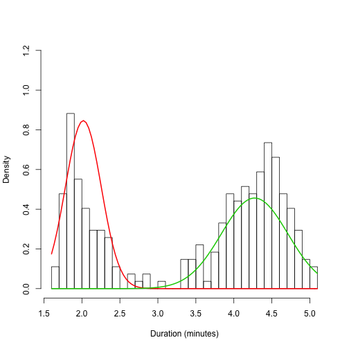

## Up Front

* The Old Faithful geyser eruption is famously bimodal, but is each mode normal?
* For other data sets, it can be useful to try a normal mixture distribution.
* This app is limited to the geyser data and serves as a prototype for more elaborate exploration.

---

## Computation

The mixtools package is used for the normal mixture solution. This example shows the results of fitting a mixture of two normals.


```r
 library(mixtools)
 fit <- normalmixEM(faithful$eruptions, k=2);
```

```
## number of iterations= 24
```

```r
 show(fit$mu);show(fit$sigma)
```

```
## [1] 2.019 4.273
```

```
## [1] 0.2356 0.4371
```

---


## Graph Output

Individual normal curves are plotted over a histogram of the data.

```
## number of iterations= 29
```

 

---


## Next Steps

* Support arbitrary data sets
* Plot the combined mixture distribution
* Show the paramaters for each fit (mean and standard deviation)
* Show statistics that quantify the quality of the fit


